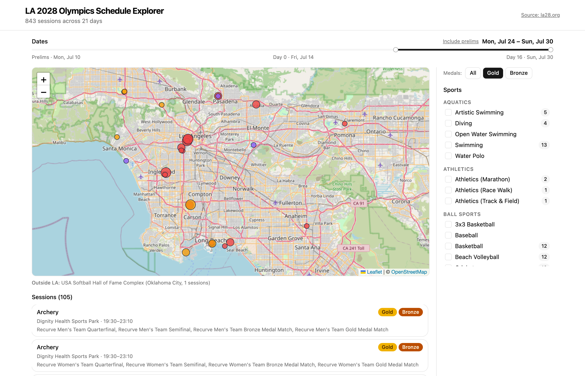

# 🏅 Olympics LA28

Structured data for the **LA 2028 Olympic Games** competition schedule.

Extracted from the [official LA28 competition schedule PDFs](https://la28.org/en/games-plan/olympics.html) and packaged as clean, machine-readable JSON and CSV. 843 sessions, 58 sports, 52 venues, 21 competition days (July 10–30, 2028). Includes a demo interactive map to explore it all.

## 📦 Data

All data files are in [`data/`](data/):

| File | What's in it |
|------|-------------|
| `schedule.json` | All 843 sessions with full detail |
| `schedule.csv` | Same data, spreadsheet-friendly |
| `venues.json` | Venue locations (lat/lng), zones, and real-world names |
| `sports.json` | 58 sports with category groupings |

### Schedule Schema

Each entry in `schedule.json` represents one competition session:

```json
{
  "sport": "Athletics (Track & Field)",
  "venue": "LA Memorial Coliseum",
  "zone": "Exposition Park",
  "session_code": "ATH01",
  "date": "2028-07-15",
  "day_of_week": "Saturday",
  "games_day": 1,
  "session_type": "Preliminary",
  "events": [
    "Women's 100m Preliminary",
    "Men's 100m Preliminary"
  ],
  "start_time": "09:00",
  "end_time": "13:30",
  "times_are_local": "PT",
  "has_gold_medal": false,
  "has_bronze_medal": false
}
```

- `games_day` — Day relative to the Opening Ceremony (Day 0 = July 14). Prelims start at Day -4, Closing Ceremony is Day 16.
- `times_are_local` — `"PT"` for Pacific Time, `"OKC"` for Oklahoma City local time (Central Time).
- `events` — Individual events/rounds within the session.
- 🥇 `has_gold_medal` — `true` if the session includes gold medal events (finals).
- 🥉 `has_bronze_medal` — `true` if the session includes bronze medal events.

### Venue Schema

`venues.json` maps official LA28 venue names to geographic data:

```json
{
  "2028 Stadium": {
    "local_name": "SoFi Stadium",
    "lat": 33.9535,
    "lng": -118.3392,
    "zone": "Inglewood",
    "city": "Inglewood",
    "state": "CA",
    "is_la_area": true
  }
}
```

- `local_name` — The name you actually know (LA28 uses generic names for sponsorship reasons, e.g. "2028 Stadium" → SoFi Stadium).
- `is_la_area` — `true` for greater LA venues, `false` for remote venues (OKC, NYC, Nashville, etc.).

### Sports Schema

`sports.json` lists all 58 sports with category groupings:

```json
{
  "sport": "Swimming",
  "category": "Aquatics",
  "session_count": 17
}
```

Categories: Aquatics, Athletics, Ball Sports, Combat Sports, Cycling, Gymnastics, Other, Racquet Sports, Shooting & Archery, Water Sports.

## 🔧 Data Extraction

Want to re-run the extraction yourself? The source PDFs are in [`pdfs/`](pdfs/).

```bash
# Requires Python 3.9+ and pdfplumber
uv run --with pdfplumber python scripts/extract_schedule.py

# Or with pip
pip install pdfplumber
python scripts/extract_schedule.py
```

## 🗺️ Demo Visualization



An interactive map explorer built with React, Leaflet, and shadcn/ui.

```bash
cd demo
npm install
npm run dev
```

Then open http://localhost:5173.

What you get:
- 🗺️ Interactive Leaflet map of LA-area Olympic venues
- 📅 Date range slider — scrub from prelims through the Closing Ceremony
- 🥇 Medal filter — zero in on gold and bronze medal sessions
- 🏀 Sport filter with category groupings and session counts
- 📋 Session list with event details and venue popups
- ✈️ Non-LA venues (soccer in NYC, softball in OKC, canoe slalom in OKC) listed separately

## 📝 Data Source

All schedule data is from the [LA28 Official Competition Schedule v3.0](https://la28.org/en/games-plan/olympics.html) (as of March 16, 2026). The schedule is subject to change until the conclusion of the Games.

## License

MIT-0 (MIT No Attribution) — do whatever you want with it.
